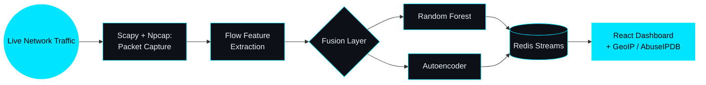

# VISAL SATTAR
### NETWORK DEFENSE | INTRUSION DETECTION | APPLIED MACHINE LEARNING

  

[-0D1117?style=for-the-badge&logo=databricks&logoColor=00E5FF)](#)

 

### 🖧 ABOUT

I'm a Computer Science student at The University of Agriculture, Peshawar. My coursework and final-year project are done, and the degree is expected in December 2026. I'm looking for an entry-level SOC or cybersecurity analyst role.

Most of my work is on the network side: capturing live traffic, turning packets into flow features, scoring them with ML models, and getting alerts in front of an analyst quickly. I also care about testing claims before I make them, which is why the IDS repo documents what doesn't work yet as well as what does.

- 🛡️ **Security & networking:** packet capture (Scapy, Npcap), Wireshark, Nmap, TCP/IP, threat-intel enrichment (GeoIP, AbuseIPDB), alert severity classification
- ⚙️ **Systems:** Linux, Windows, PowerShell, Docker / Docker Compose, Redis Streams, Flask
- 🧪 **ML & testing:** scikit-learn, TensorFlow/Keras, pytest
- 🎯 **Looking for:** SOC Analyst · Junior Cybersecurity Analyst · Security-focused software roles

---

### 🛡️ AI-BASED INTRUSION DETECTION SYSTEM
**[Repository →](https://github.com/visalsattar/AI-Based-Intrusion-Detection-System-for-Real-Time-Network-Threat-Detection)** · Final-year project, Nov 2025 – May 2026

A network IDS that sniffs live traffic, builds 78 CICFlowMeter-style features per flow, and scores each flow with a Random Forest fused with an Autoencoder trained on benign traffic. Alerts go through Redis Streams to a React dashboard. A CNN was trained and benchmarked offline for comparison but isn't in the live path, because it needs 100-flow windows that live capture can't provide.

What the numbers are, and what they aren't:

- On a 45,149-flow held-out CICIDS2017 DDoS/benign split (chronological, no shuffling), the Random Forest scores 99.50% F1 and the fused live rule scores 99.69% F1. These are offline results on one attack type.
- Final packet to prediction takes 98 ms median and 115 ms p95 on synthetic flows. Redis publishing stays under 2.2 ms p99.
- 248 pytest tests cover preprocessing, train/test leakage, fusion logic, feature parity against CICFlowMeter reference fixtures, API auth, and the optional IP auto-blocking.
- The Docker setup drops all Linux capabilities. The opt-in sniffer service gets only `NET_RAW`, and `NET_ADMIN` stays off unless auto-blocking is deliberately enabled. Redis and the API bind to localhost with a password.
- **Known limitation:** in controlled LAN tests the model stays quiet on normal traffic but misses a fast TCP flood, because the training "DDoS" class is slow LOIC-style traffic. Live generalisation is the open problem I'm working on now.

**Stack:** Python 3.11 · Scapy · scikit-learn · TensorFlow · Flask · Redis · Socket.IO · React · Docker · pytest · PowerShell

---

### 🎯 YOLOv8 UNDERWATER TRASH DETECTION
**[Repository →](https://github.com/visalsattar/yolo_detection_app)** · Personal project, Feb 2024 – Dec 2024

YOLOv8 segmentation model fine-tuned on the TrashCan underwater dataset (22 classes, 0.71 box mAP@50), served through a Flask app that takes an uploaded image and returns labelled detections. I also trained on Trash-ICRA19, Drinking Waste and UAVVaste before choosing TrashCan.

**Stack:** Python · YOLOv8 · PyTorch · OpenCV · Flask

---

### 💼 EXPERIENCE

**Web Development & Database Intern** · Ministry of Agriculture, Bureau of Agriculture Information Department · *Jun 2023 – Dec 2023*

Built responsive internal web pages (HTML, CSS, JavaScript, Bootstrap), designed SQL schemas and reporting queries, and wrote a JavaScript time-tracking tool for staff.

---

### 📜 CERTIFICATIONS

- **Google Cybersecurity Professional Certificate**, Google (Coursera), completed May 2026
- **CompTIA Security+**, exam planned December 2026
