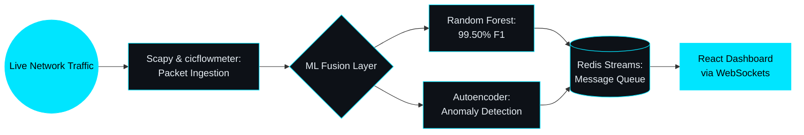
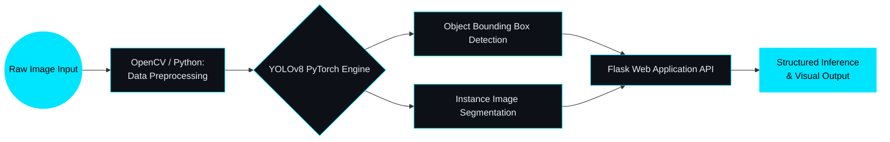

# VISAL SATTAR
### NETWORK DEFENSE | COMPUTER VISION | APPLIED MACHINE LEARNING

  

 

### 🖧 CORE FOCUS & CAPABILITIES

Computer Science undergraduate (Expected May 2026) specializing in network defense pipelines and computer vision automation. Focused on capturing raw traffic, training ensemble threat classifiers, and deploying containerized, real-time ML applications.

- 🛡️ **Network Security:** Real-Time Flow Analysis, Packet Sniffing, Threat Intelligence Lookups, NIST SP 800-30 Alignment
- 👁️ **Computer Vision:** YOLOv8 Object Detection, Image Segmentation, Dataset Preprocessing & Fine-Tuning
- ⚙️ **Systems & Infrastructure:** Docker Containerization, Redis Streams, Flask APIs, Linux/PowerShell Scripting
- 🎯 **Target Roles:** SOC Analyst | Junior Cybersecurity Analyst | ML/Security Software Engineer

---

### 🛡️ FEATURED PROJECT 01: AI-BASED INTRUSION DETECTION SYSTEM (IDS)

> Real-time ensemble network anomaly detection pipeline benchmarked against the CICIDS2017 dataset. A CNN architecture was separately trained and evaluated offline for comparison purposes only — it is not part of the live fusion pipeline.

- **Engineered Real-Time Ingestion:** Processed live network flow data with Scapy and cicflowmeter inside isolated Python virtual environments.
- **Ensemble Threat Classification:** Benchmarked classification models against the CICIDS2017 dataset (225,745 flows), achieving a 99.50% F1-score on the live Random Forest classifier (a CNN variant was evaluated offline at 99.51% F1 for architecture comparison — not deployed in the live pipeline).
- **Live Intelligence Enrichment:** Streamed alerts via WebSockets and Redis Streams to a React dashboard with integrated GeoIP and AbuseIPDB threat intelligence.
- **Container Deployment:** Containerized full-stack services using Docker; the packet-capture service requires elevated `NET_ADMIN`/`NET_RAW` capabilities to read raw traffic (documented and scoped to that container only).

**Tech Stack:** Python 3.11 | cicflowmeter | Scapy | TensorFlow | scikit-learn | Redis | Docker | React

---

### 🎯 FEATURED PROJECT 02: YOLOv8 WASTE DETECTION & SEGMENTATION ENGINE

Computer vision pipeline fine-tuned on ICRA Trash & Drinking Waste datasets for automated visual identification.

- **Custom Model Fine-Tuning:** Trained YOLOv8 object detection and segmentation architectures across diverse environmental waste categories.
- **Inference Web Service:** Integrated trained models into a lightweight Flask web application to process image uploads and stream structured bounding-box detections.
- **Data Preprocessing Pipeline:** Automated data cleaning, bounding box normalization, and validation augmentation across multi-source benchmark datasets.

**Tech Stack:** Python | YOLOv8 | Flask | OpenCV | Jupyter Notebook | PyTorch

---

### 💼 PROFESSIONAL EXPERIENCE

**Web Development & Database Intern | Ministry of Agriculture — Bureau of Agriculture Information Dept.**
*Jun 2024 – Dec 2024*
- Streamlined department reporting workflows by architecting 12+ optimized relational SQL database queries, reducing weekly manual report generation time by ~80%.
- Deployed an internal JavaScript operational time-tracking utility adopted by 25+ departmental staff members, replacing legacy manual logging processes.
- Developed responsive web application components using HTML5, CSS3, JavaScript, and Bootstrap, improving cross-device interface accessibility across department endpoints.

---

### 📜 CERTIFICATIONS & COURSEWORK

- **Google Cybersecurity Professional Certificate** — Google (Coursera)
- **CS50: Introduction to Computer Science** — HarvardX / edX
- **CompTIA Security+** — Target: Dec 2026 (not yet completed)
